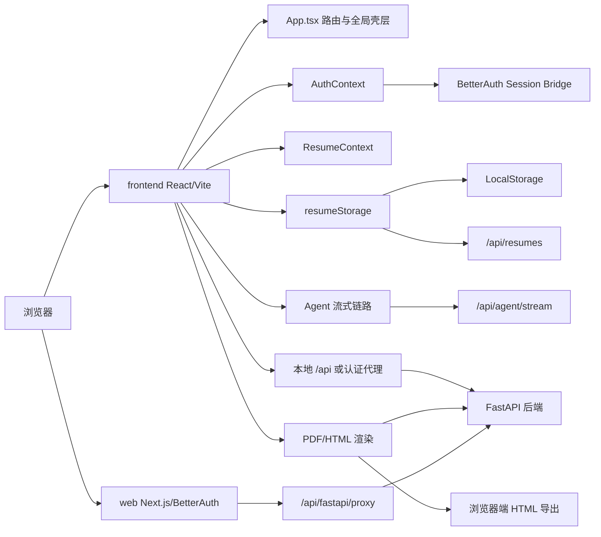
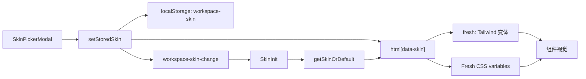

# Resume-Agent 前端架构

> 本文以当前 `main` 分支代码为准，记录产品前端的应用边界、核心数据流、主要模块和开发落点。
>
> 最近阅读时间：2026-08-01

## 1. 文档范围

Resume-Agent 的前端由两个相互配合的应用组成：

| 应用 | 目录 | 技术栈 | 主要职责 |
| --- | --- | --- | --- |
| 主产品应用 | `frontend/` | React 18、TypeScript、Vite、Tailwind CSS | 首页、简历管理、简历编辑器、预览、导出、Agent 工作台 |
| 认证与代理应用 | `web/` | Next.js、React 19、BetterAuth、PostgreSQL | 登录/注册、会话管理、认证桥接、FastAPI 代理 |

`frontend/` 是主要的业务 UI；`web/` 的页面较少，更多承担认证和 BFF/代理层的职责。

## 2. 总体架构



核心原则可以概括为：

1. React 应用负责交互、编辑状态和展示。
2. `ResumeData` 是编辑器的主要业务模型。
3. `resumeStorage` 屏蔽匿名本地存储和登录后的云端存储差异。
4. LaTeX 预览主要依赖后端渲染，HTML 模板可以在浏览器端导出。
5. Agent 的原始流式事件先转换为规范事件，再经过 reducer 和 presentation 层展示。

## 3. 主应用启动与路由

主入口：[`src/main.tsx`](src/main.tsx)

启动时依次完成：

- 清理一次性 chunk reload 标记。
- 初始化认证请求行为。
- 创建 `EnvironmentProvider`。
- 创建 `AuthProvider`。
- 渲染 `App`。

应用壳层和路由集中在 [`src/App.tsx`](src/App.tsx)。主要路由如下：

| 路由 | 页面职责 |
| --- | --- |
| `/` | 首页/产品介绍 |
| `/workspace`、`/workspace/:resumeId` | 统一简历编辑工作台 |
| `/agent/:resumeId` | Agent 对话式简历工作台 |
| `/my-resumes` | 简历列表、创建、导入、删除、复制、导出 |
| `/settings`、`/account`、`/pricing` | 设置、账户和权益相关页面 |
| `/admin` | 管理后台，按管理员权限开放 |
| `/share/:shareId` | 分享预览 |
| `/leetcode/*` | LeetCode 相关功能 |

旧的 `/builder`、部分旧的 LaTeX/HTML 路由会重定向到统一工作台。当前权限保护更多由页面或具体操作完成，而不是由一个统一的 `ProtectedRoute` 完成。

## 4. 目录职责

```text
frontend/src
├── main.tsx                  # React 入口
├── App.tsx                   # 路由、全局 Provider、全局弹层
├── contexts/                 # 环境、认证、当前简历等全局状态
├── pages/                    # 按业务域组织的页面
│   ├── Workspace/v2/         # 当前主简历编辑器
│   ├── AgentChat/            # Agent 对话工作台
│   ├── ResumeDashboard/      # 简历管理
│   ├── Builder/              # HTML 模板与渲染基础设施
│   └── ...                   # 设置、账户、分享、LeetCode 等
├── components/               # 跨页面 UI、Agent UI、编辑器公共组件
├── services/                 # API、认证会话、存储、Agent 流
├── agent-presentation/       # Agent 事件、reducer、展示投影
├── hooks/                    # 跨业务或兼容层 Hook
├── lib/                      # 运行环境、主题、皮肤、工具函数
├── types/                    # 旧的/通用类型
└── utils/                    # Patch、诊断、转换等工具
```

新功能优先放入对应业务域；只有真正跨业务复用的内容才放入 `components/`、`hooks/` 或 `services/`。

## 5. 全局状态

### 5.1 EnvironmentContext

文件：[`src/contexts/EnvironmentContext.tsx`](src/contexts/EnvironmentContext.tsx)

负责：

- local 和 remote-dev 环境切换。
- API 基地址计算。
- Agent 开关和部分实验功能开关。
- 与环境相关的本地配置。

相关运行时逻辑在 [`src/lib/runtimeEnv.ts`](src/lib/runtimeEnv.ts)。

### 5.2 AuthContext

文件：[`src/contexts/AuthContext.tsx`](src/contexts/AuthContext.tsx)

负责：

- 获取和监听 BetterAuth 会话。
- 保存当前用户、角色和权益信息。
- 登录、退出和认证弹窗跳转。
- 在用户切换后通知简历存储层切换账号上下文。

认证已经以 BetterAuth 会话为主，旧 JWT 逻辑仍有少量兼容代码，不应在新功能中继续扩展旧认证方式。

### 5.3 ResumeContext

文件：[`src/contexts/ResumeContext.tsx`](src/contexts/ResumeContext.tsx)

负责跨 Workspace 和 Agent 共享当前简历，以及管理 Agent 生成的简历 Patch：

- 当前 `resume`。
- Patch 应用、撤销、恢复、替换和重新绑定。
- Patch 产生的待处理状态。
- Agent 和编辑器之间的简历同步。

它不是完整的持久化层；真正的保存应该通过 `resumeStorage` 或其上层 Hook 完成。

## 6. 简历数据模型

当前编辑器的主要模型是 [`src/pages/Workspace/v2/types/index.ts`](src/pages/Workspace/v2/types/index.ts) 中的 `ResumeData`。

主要内容包括：

- 基本信息。
- 教育经历。
- 全职经历和实习经历。
- 项目、开源经历、奖项。
- 技能、自我评价和自定义模块。
- 模块顺序和显示配置。
- 模板类型、模板 ID 和全局排版设置。

富文本内容主要以 TipTap HTML 字符串保存。`ResumeData` 会被转换到不同的下游模型：

```text
ResumeData
├── convertToBackend.ts -> BackendResumeData -> FastAPI/LaTeX
└── Builder/adapter.ts  -> BuilderResumeData -> HTML 模板
```

因此，新增一个简历字段时，通常需要同步检查：

1. `ResumeData` 类型。
2. 默认值和迁移逻辑。
3. `useResumeData` 的更新方法。
4. 对应的编辑面板。
5. 后端转换逻辑。
6. Builder HTML 转换逻辑。
7. Agent 导入/规范化逻辑。
8. 持久化和测试。

## 7. Workspace 编辑器

入口：[`src/pages/Workspace/v2/index.tsx`](src/pages/Workspace/v2/index.tsx)

```text
Workspace
├── useResumeData          # 当前简历数据和模块操作
├── useAutoSaveResume      # 防抖自动保存
├── usePDFOperations       # LaTeX 预览、下载和渲染控制
├── useAIImport            # AI 导入
├── EditPreviewLayout      # 左编辑、中间配置、右预览布局
├── SidePanel              # 模块导航
├── EditPanel              # 各类简历模块编辑器
├── PreviewPanel           # PDF/HTML 预览
└── SettingsDrawer         # 模板和排版设置
```

编辑数据流：

```text
用户输入
  -> EditPanel
  -> useResumeData
  -> ResumeContext
  -> 本地草稿
  -> useAutoSaveResume
  -> resumeStorage
```

### LaTeX 预览

LaTeX 类型的预览主要走后端流式渲染：

```text
ResumeData
  -> convertToBackend
  -> renderPDFStream
  -> PDF Blob
  -> PDFViewerSelector
```

渲染过程包含 AbortController、版本号和简历 ID 检查，用于避免旧请求覆盖新预览。

### HTML 预览和导出

HTML 类型会复用 Builder 的模板和渲染器：

```text
ResumeData
  -> Builder adapter
  -> ResumeRenderer/PaginatedPreview
  -> html2pdf
```

`pages/Builder/` 目前主要是模板和渲染基础设施，不应再把它当成新的独立编辑器入口。

## 8. 存储和自动保存

入口：[`src/services/resumeStorage.ts`](src/services/resumeStorage.ts)

存储抽象由以下几层组成：

```text
resumeStorage facade
├── LocalStorageAdapter       # 匿名用户
└── DatabaseAdapter            # 登录用户
```

主要行为：

- 匿名用户数据保存在浏览器本地。
- 登录用户优先使用账号对应的云端数据。
- 登录后可将匿名本地简历迁移到当前账号。
- 云端数据有账号隔离的本地缓存。
- 账号切换时会取消旧请求，避免串号写入。
- 简历列表存储前会清理照片等不适合列表持久化的内容。

页面和组件不应直接操作 `localStorage` 保存完整简历，统一优先使用 `resumeStorage`。

## 9. 认证与 API 请求

### 本地开发

默认情况下，Vite 将前端 `/api` 请求代理到本地 FastAPI：

```text
浏览器 -> frontend /api -> Vite proxy -> 127.0.0.1:9000
```

配置位于 [`vite.config.ts`](vite.config.ts)。

### 使用认证 Web 应用时

当配置了 `VITE_AUTH_WEB_URL` 时，请求会经过 Next.js 认证代理：

```text
frontend
  -> web /api/auth-bridge/session
  -> BetterAuth 会话
  -> web /api/fastapi/proxy
  -> FastAPI
```

代理层负责读取 BetterAuth 会话，并向内部 FastAPI 请求注入可信用户信息。前端新代码应使用当前会话机制，不应重新引入浏览器端长期 JWT。

业务 API 大部分集中在 [`src/services/api.ts`](src/services/api.ts)，但 Agent 历史记录、文件上传和部分导入逻辑仍有组件内直接 `fetch`。后续可以逐步将这些请求收敛到服务层。

## 10. Agent 流式架构

Agent 主页面：[`src/pages/AgentChat/CocoChat.tsx`](src/pages/AgentChat/CocoChat.tsx)

当前 Agent 采用“原始事件 → 规范事件 → reducer 状态 → 时间投影 → UI”的链路：

```text
ReadableStream/SSE
  -> services/agentStream.ts
  -> agent-presentation/AgentEventAdapter.ts
  -> agent-presentation/ConversationRunReducer.ts
  -> ConversationPresentation.ts
  -> StreamingLane
  -> ConversationTurnView
```

### 原始流

[`src/services/agentStream.ts`](src/services/agentStream.ts) 负责：

- 发起 `/api/agent/stream` 请求。
- 解析 SSE block。
- 校验事件 envelope。
- 处理心跳、超时和 AbortController。
- 确保流以 `done` 或明确失败状态结束。

### 规范事件和 reducer

规范事件定义在 [`src/agent-presentation/events.ts`](src/agent-presentation/events.ts)，包括：

- thought
- tool started/completed/progressed
- response reset/updated
- run completed/cancelled/failed
- artifact
- suggestions

[`ConversationRunReducer.ts`](src/agent-presentation/ConversationRunReducer.ts) 负责：

- 事件去重。
- 按服务端序号排序。
- 更新工具进度和思考节点。
- 累积响应文本。
- 保存 Artifact 和 suggestions。
- 维护运行状态和错误。

### Agent 对简历的修改

Agent 产生的简历修改通常经过 Patch：

```text
Agent event
  -> useToolEventRouter
  -> ResumeContext.applyPatchPaths
  -> 当前简历更新
  -> 自动保存/用户撤销
```

新增加的结构化输出卡片，应优先通过 `StructuredCardRegistry` 接入，而不是在 `CocoChat` 中继续增加条件分支。

## 11. UI、主题与换肤系统

样式体系主要由 Tailwind utility classes、CSS variables、`data-skin` 皮肤、`.dark` 主题、业务组件以及 Framer Motion 动画组成。

### 11.1 皮肤与主题不是同一套状态

| 维度 | 界面皮肤 | 深浅色主题 |
| --- | --- | --- |
| 类型 | `neo \| fresh` | `light \| dark \| system` |
| 默认值 | `fresh` | `light` |
| 本地存储 | `workspace-skin` | `app-theme` |
| 根节点标记 | `<html data-skin="...">` | `<html class="dark">` |
| Tailwind 用法 | 基础类代表 NEO，`fresh:` 覆盖 Fresh | `dark:` 覆盖深色 |
| 权限 | 所有用户可切换 | 当前仅管理员实际生效 |
| 核心文件 | `src/lib/skin.ts`、`SkinInit.tsx` | `src/lib/theme.ts`、`ThemeInit.tsx` |

皮肤决定视觉语言，例如圆角、边框、阴影、字体和部分颜色；主题决定亮色或深色。两者可以同时命中，因此修改组件时不能把 `fresh:` 当成 `dark:` 的替代品。

### 11.2 换肤状态流

核心文件：

- [`src/lib/skin.ts`](src/lib/skin.ts)：皮肤类型、读取、默认值、写入和事件广播。
- [`src/components/SkinInit.tsx`](src/components/SkinInit.tsx)：应用启动时把皮肤写到 `<html>`，并监听切换事件。
- [`src/pages/Workspace/v2/components/SkinPickerModal.tsx`](src/pages/Workspace/v2/components/SkinPickerModal.tsx)：NEO/Fresh 选择器和预览卡。
- [`tailwind.config.js`](tailwind.config.js)：注册 `fresh:` 变体和 `chat-*` 语义色。
- [`src/tailwind.css`](src/tailwind.css)：Fresh 皮肤的 CSS variable 覆盖。



`getStoredSkin()` 在用户从未选择时返回 `null`；`getSkinOrDefault()` 在这种情况下返回 `fresh`。当前切换入口包括：

- 首次进入 `Workspace/v2` 时的强制选择框。
- Workspace 顶部操作区的“界面皮肤”。
- WorkspaceLayout 左下角用户菜单的“界面皮肤”。

皮肤状态不需要进入 React Context。`setStoredSkin()` 会立即更新 `<html>` 并广播事件，CSS 负责完成绝大部分重绘。

### 11.3 两层换肤方式

#### 第一层：语义 token

Agent、简历列表等共享界面优先使用 `chat-*` 语义类：

| 语义类 | 用途 |
| --- | --- |
| `bg-chat-canvas` | 页面或区域底色 |
| `bg-chat-surface` | 卡片、面板表面 |
| `text-chat-ink` | 主要文字 |
| `text-chat-ink-muted` | 次要文字 |
| `bg-chat-accent` | 主强调色 |
| `bg-chat-accent-deep` | 强调色深色状态 |
| `bg-chat-user-bubble` | 用户消息气泡 |
| `border-chat-border` | 语义边框色 |

这些 token 在 `tailwind.config.js` 中以 CSS variable 加 NEO fallback 定义；`[data-skin='fresh']` 在 `tailwind.css` 中覆盖变量。只涉及已抽象颜色时，组件通常不需要再写一组 `fresh:` 颜色类。

新增语义色时需要同时完成：

1. 在 `tailwind.config.js` 中增加带 NEO fallback 的 `var(--token, fallback)`。
2. 在 `tailwind.css` 的 `[data-skin='fresh']` 中增加 Fresh 值。
3. 在组件中使用语义类，避免继续散落硬编码颜色。

#### 第二层：`fresh:` 显式覆盖

圆角、边框宽度、硬阴影、字体、字距和位移动效无法只靠颜色 token 表达，使用成对的 Tailwind 类：

| 视觉维度 | NEO 基础类 | Fresh 覆盖类 |
| --- | --- | --- |
| 圆角 | `rounded-none` | `fresh:rounded-lg` 或 `fresh:rounded-md` |
| 边框 | `border-2 border-black` | `fresh:border fresh:border-slate-200` |
| 阴影 | `shadow-[2px_2px_0px_0px_#000000]` | `fresh:shadow-sm` |
| 字体 | `font-mono` | `fresh:font-sans` |
| 大小写 | `uppercase` | `fresh:normal-case` |
| 字距 | `tracking-wide` | `fresh:tracking-normal` |
| 硬位移动效 | `hover:translate-x-[1px] hover:translate-y-[1px]` | `fresh:hover:translate-x-0 fresh:hover:translate-y-0` |

约定是“无前缀的基础类表示 NEO，`fresh:` 只写差异”。不要反过来把 Fresh 写成基础类，否则旧组件和未覆盖区域会失去 NEO 风格。

### 11.4 AI 修改 UI 时必须遵守的规则

AI 修改任何页面或组件样式时，按以下顺序判断：

1. 先判断改动是否影响皮肤视觉：颜色、背景、边框、圆角、阴影、字体、大小写、字距和交互动效都属于换肤范围；纯布局尺寸和业务逻辑通常不需要皮肤分支。
2. 保留 NEO 基础样式，并为 Fresh 增加对应的 `fresh:` 覆盖；不要只让当前默认 Fresh 看起来正确。
3. Agent、Dashboard 或跨页面卡片的颜色优先使用 `chat-*` 语义 token。
4. 不要在业务组件中读取 `localStorage`、判断 `data-skin` 或新增皮肤 React state；普通组件只使用 token 和 Tailwind variant。
5. 不要把皮肤逻辑与 `dark:` 混为一体。涉及文字和背景时，还要独立检查 `dark:` 下的对比度。
6. 新增公共组件时至少检查 NEO + Fresh；如果组件支持暗色，再检查 NEO Dark + Fresh Dark。
7. 修改 Picker、皮肤枚举或默认值时，同时检查首次进入弹窗、用户菜单入口和刷新后的持久化行为。

一个符合现有约定的卡片示例：

```tsx
<section
  className="rounded-none fresh:rounded-lg
             border-2 border-black fresh:border fresh:border-slate-200
             bg-chat-surface text-chat-ink
             shadow-[2px_2px_0px_0px_#000000] fresh:shadow-sm
             dark:border-white dark:bg-slate-900 dark:text-slate-100"
>
  ...
</section>
```

如果视觉调整是全局的，应优先改 token；如果只是某个组件在两套视觉语言下结构不同，再使用 `fresh:`。不要为了换一个颜色复制整棵组件树。

### 11.5 修改现有皮肤和新增皮肤

修改 Fresh 的全局颜色时，优先调整 `tailwind.css` 的 `[data-skin='fresh']` token。修改 NEO 的语义色时，调整 `tailwind.config.js` 中对应 token 的 fallback，并回归未写 `fresh:` 的界面。

如果未来要增加第三套皮肤，需要同步：

1. 扩展 `WorkspaceSkin` 联合类型和存储校验。
2. 在 Tailwind 中注册新的 variant，或把更多视觉属性迁移为 CSS variables。
3. 添加对应的 `[data-skin='...']` token 集合。
4. 在 `SkinPickerModal` 中增加预览和选项。
5. 检查现有仅写了 `fresh:` 的结构样式是否需要第三套覆盖。
6. 覆盖首页、Dashboard、Workspace、Agent、弹窗和公共组件的视觉回归。

当前只有两个皮肤时，`fresh:` 差异模式仍然清晰；增加第三个皮肤前，建议先把边框、圆角、阴影、字体等进一步 token 化，避免每个组件出现多组 variant。

### 11.6 UI 文件归属

- 页面级布局放在对应 `pages/` 目录。
- Agent 通用消息/卡片放在 `components/agent-chat` 或 `components/chat`。
- 真正通用的基础组件才放入 `components/ui`。
- 优先使用现有语义色和 `data-skin` 机制，不在业务组件内重复定义整套颜色。

## 12. 测试与验证

前端使用 Vitest，测试主要分布在以下领域：

- Agent event adapter。
- Conversation reducer 和 presentation。
- Agent 组件。
- `useCLTP` 和工具事件路由。
- ResumeData 和 Workspace 数据操作。
- Agent stream。
- 简历诊断和 Patch 工具。

当前没有发现完整的 Playwright/Cypress 端到端测试配置。涉及以下链路的改动，建议至少手动验证：

1. 匿名用户创建、编辑和刷新页面。
2. 登录后云端保存和账号切换。
3. LaTeX 和 HTML 两种模板预览/下载。
4. Agent 流式输出、中断和失败恢复。
5. Agent 修改简历后的撤销和重新加载。

常用命令：

```bash
cd frontend
npm run dev
npm run build
npm run test
```

## 13. 当前架构债务

以下内容是后续维护时需要注意的已知复杂点：

- `CocoChat.tsx` 承担了过多页面编排职责。
- `services/api.ts` 是较大的综合 API 服务。
- 新旧 `Resume`/`ResumeData` 类型并存。
- Backend、Builder 和前端之间存在多层数据转换。
- `useCLTP`、`SSETransport`、`LegacyPresentationAdapter` 等名称反映了历史兼容层。
- Agent 历史持久化存在 Hook 和组件内联实现并存的情况。
- 部分旧页面、旧路由和旧文档仍然存在，修改时应先确认是否仍被主流程使用。

这些问题不等于当前功能不可用，但新增功能时应尽量避免继续扩大兼容层。

## 14. 开发落点速查

| 需求 | 优先查看 |
| --- | --- |
| 修改首页 | `frontend/src/pages/LandingPage.tsx` |
| 修改简历列表 | `frontend/src/pages/ResumeDashboard/` |
| 修改编辑面板 | `frontend/src/pages/Workspace/v2/EditPanel/` |
| 修改工作台布局 | `frontend/src/pages/Workspace/v2/EditPreviewLayout.tsx` |
| 修改 PDF 预览 | `frontend/src/pages/Workspace/v2/PreviewPanel/`、`usePDFOperations.ts` |
| 修改 HTML 模板 | `frontend/src/pages/Builder/` |
| 修改 Agent 对话 UI | `frontend/src/components/agent-chat/`、`CocoChat.tsx` |
| 修改 Agent 事件 | `frontend/src/agent-presentation/`、`services/agentStream.ts` |
| 修改 Agent 卡片 | `StructuredCardRegistry.tsx` |
| 修改简历持久化 | `frontend/src/services/resumeStorage.ts` |
| 修改认证 | `frontend/src/contexts/AuthContext.tsx`、`web/src/lib/auth.ts` |
| 修改 API 地址 | `frontend/src/lib/runtimeEnv.ts`、`frontend/vite.config.ts` |
| 修改界面皮肤 | `frontend/src/lib/skin.ts`、`SkinInit.tsx`、`tailwind.config.js`、`tailwind.css`、`SkinPickerModal.tsx` |

## 15. 推荐的演进方向

短期建议：

1. 继续以 `Workspace/v2` 的 `ResumeData` 作为主模型。
2. 新功能统一走 `resumeStorage`，避免新增直接 `localStorage` 持久化。
3. 新 Agent 事件优先接入规范事件、reducer 和 Registry。
4. 将 Agent 历史、导入和文件上传请求逐步移出组件。

中期建议：

1. 拆分 `CocoChat` 的会话、导入、预览和历史职责。
2. 将 `services/api.ts` 按业务域拆成 resume、PDF、AI、billing 等服务。
3. 统一旧 `Resume` 类型和 `ResumeData` 的边界。
4. 清理已经不再使用的旧路由、兼容适配器和过期文档。
5. 为 Workspace 和 Agent 主流程补充端到端测试。
